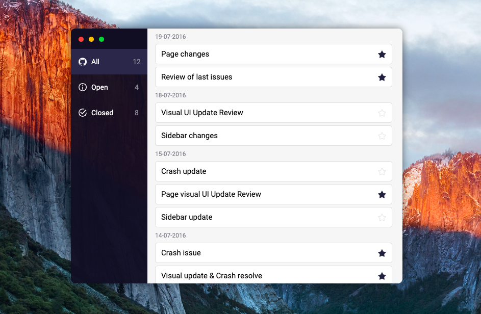

# GitHub issues 💻
Reproducing the design of the app for fetching GitHub issues. 

[Website demo](https://agatapst.github.io/github-issues/)

## Table of Contents
- General info
- Setup
- Technologies
- Additional info

### General info
The aim of the project was to reproduce the design of the app for fetching GitHub issues in the "pixel perfect" way. The design was presented in the PSD file.

### Setup
Install dependencies

    $ npm install

Compile SCSS

    $ gulp watch

### Technologies
- CSS3 / SCSS
- HTML5
- Gulp 

### Additional info
The PSD design contains premium Adobe *Proxima Nova* font. For the purpose of this project the free *Roboto* font was used instead.